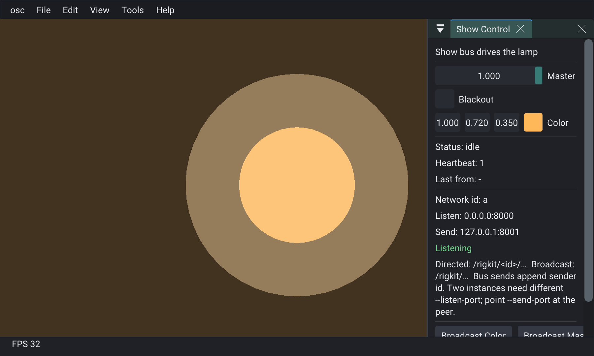

# Example OSC



Lamp follows Master / Blackout / Color. Window title shows `[network-id]`. **Broadcast Color / Master** send `/rigkit/…` (no id) so every peer listening on the send target picks it up; **Last from** shows the sender id carried on the message.

```bash
cmake -S examples/osc -B examples/osc/build
cmake --build examples/osc/build --target osc
./examples/osc/build/bin/osc/osc
./examples/osc/build/bin/osc/osc --smoke-osc

# Two instances (directed heartbeat + broadcast buttons)
./examples/osc/build/bin/osc/osc --network-id=a --listen-port=8000 --send-port=8001
./examples/osc/build/bin/osc/osc --network-id=b --listen-port=8001 --send-port=8000
```

Multi-instance author/show shell: RigKit `examples/oscHost`.
